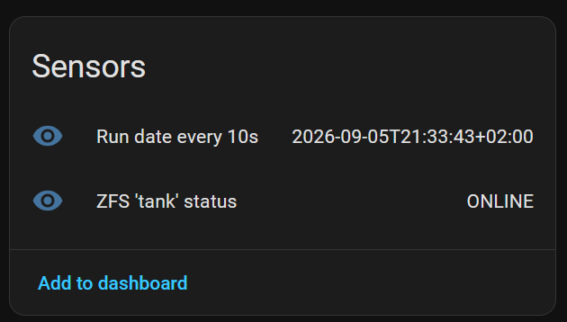

# ESPHome Host Command

`host_command` is an ESPHome component for the [`host`](https://esphome.io/components/host/) platform that executes predefined local commands and exposes their results through ESPHome entities.

This component is currently under **early development**.

The ESPHome `host` platform allows ESPHome to run as a native application on a Linux system instead of on a microcontroller such as an ESP32. This provides the familiar ESPHome configuration and native API, including integration with Home Assistant, while running directly on a Linux host.

`host_command` extends this functionality by allowing commands configured in ESPHome YAML to be executed on the underlying Linux system and their output to be exposed as entities in Home Assistant.

## Development disclaimer

This component was primarily designed and written with the assistance of **ChatGPT (GPT-5.6 Sol)**. The generated code and design decisions have been manually reviewed, compiled, and tested by the project author.

The author is developing an ESPHome component for the first time and had not written C or C++ for approximately 15 years before starting this project. As a result, the code should not be assumed to follow ESPHome or modern C++ best practices simply because it compiles and works. Additional review, testing, and contributions from experienced ESPHome and C++ developers are welcome.

## Features

Currently supported:

* `text_sensor` — periodically execute a predefined command and publish its stdout as text when the command exits successfully.
* Configurable command arguments and optional stdin data.
* Separate stdout and stderr capture.
* Configurable logging of arguments, exit status, stdin, stdout, and stderr.
* Commands are only published as a new sensor state when they exit successfully with status `0`.
* Execution as `root` is refused by default and can be enabled per entity with `allow_root: true`.

**Warning:** Command execution is currently **blocking** and there is **no timeout**. ESPHome's main loop remains blocked until the executed command exits. A command that hangs or never exits will therefore block the ESPHome node indefinitely.

Planned entity support:

* `sensor` — parse command stdout as a numeric value.
* `binary_sensor` — derive state from command execution results.
* `button` — execute a predefined command.

Commands are executed directly using `fork()` and `execv()`.


**No shell is invoked by `host_command`.**

This means shell functionality such as the following is not interpreted:

* Pipes (`|`)
* Redirection (`>`, `<`)
* Command substitution (`$()`)
* Environment expansion (`$VAR`)
* Globbing (`*`)
* Command chaining (`&&`, `;`)

If shell functionality is required, create a script containing the required logic and configure `host_command` to execute that script directly.

## Example

```yaml
external_components:
  - source: github://Kagee/host_command@main
    components:
      - host_command

host:

text_sensor:
  - platform: host_command
    name: "Run date every 10s"
    update_interval: 10s

    # These are the component-specific options for the host_command text sensor
    executable: /usr/bin/date
    arguments:
      - --iso=s
    logging:
      arguments: true
      exit_status: true
      stderr: true
      stdin: true
      stdout: true

  - platform: host_command
    name: "ZFS 'tank' status"
    update_interval: 30min

    # These are the component-specific options for the host_command text sensor
    executable: /usr/sbin/zpool
    arguments:
      - list
      - -H
      - -o
      - health
      - tank
    logging:
      arguments: false
      exit_status: false
      stderr: false
      stdin: false
      stdout: false
```

The equivalent commands are:

```text
/usr/bin/date --iso=s
/usr/sbin/zpool list -H -o health tank
```

### Home Assistant Sensors

The example above exposes the command output as two text sensor entities in Home Assistant.



## Firewall configuration

The ESPHome native API port must be accessible from Home Assistant. If OTA updates are used, the OTA port must also be accessible from the system performing the updates.

The examples below use `192.0.2.10` as the Home Assistant IP address. Replace it with the actual address of your Home Assistant server.

The relevant default ports are:

| Service            | Protocol | Port |
| ------------------ | -------- | ---: |
| ESPHome native API | TCP      | 6053 |
| ESPHome host OTA   | TCP      | 8082 |

The default API and OTA ports can be overridden in the ESPHome configuration when needed.

```yaml
api:
  port: 6054

ota:
  - platform: esphome
    port: 8083
```

Adjust any firewall rules accordingly. If OTA updates are not used, the OTA port can be omitted from the firewall configuration.

### UFW

Allow the Home Assistant server to access the native API and OTA ports:

```bash
ufw allow from 192.0.2.10 to any port 6053 proto tcp comment 'ESPHome Node API from Home Assistant'
ufw allow from 192.0.2.10 to any port 8082 proto tcp comment 'ESPHome Node OTA from Home Assistant'
```

### nftables

With nftables, add rules to the appropriate input chain:

```nftables
ip saddr 192.0.2.10 tcp dport 6053 accept comment "ESPHome Node API from Home Assistant"
ip saddr 192.0.2.10 tcp dport 8082 accept comment "ESPHome Node OTA from Home Assistant"
```

If OTA updates are performed from a different machine than Home Assistant, that machine must also be permitted to connect to the OTA port.

## Standard input and command results

Set `stdin` alongside `executable` and `arguments` to supply fixed input:

```yaml
text_sensor:
  - platform: host_command
    name: "Echo configured input"
    executable: /usr/bin/cat
    stdin: "Hello from ESPHome\n"
```

The default is an empty string. The runner writes the complete input while draining
stdout and stderr, then closes stdin so the command receives EOF. With empty or
omitted input, stdin is closed immediately; commands no longer inherit ESPHome's
stdin. No newline is added automatically. If the child closes stdin before all
input can be written, execution reports an internal delivery error and no state
is published. `logging.stdin` controls logging only; it does not supply input.

### Tip: running Bash scripts

`host_command` never inserts an implicit shell. To run a shell script, explicitly
configure the shell as the executable and provide the script through `stdin`:

```yaml
text_sensor:
  - platform: host_command
    name: "Run explicit Bash script"
    executable: /bin/bash
    stdin: !literal |-
      set -euo pipefail
      A="foo"
      echo "$A" | tr a-z A-Z
```

ESPHome normally treats `$A` and `${A}` as substitution expressions. The
`!literal` tag disables ESPHome substitution for the complete block, preserving
shell variables for Bash to expand at runtime. YAML quoting alone does not disable
ESPHome substitutions, while escaping the dollar sign as `\$A` would pass that
escape to Bash and prevent the intended expansion.

All entities can reuse the synchronous `run_command(CommandInvocation)` function in
`command_runner.h`. It returns separate, unmodified stdout and stderr strings and
distinguishes normal exits, signal termination, `execv()` failure, and internal
process/I/O errors. Normal exit codes and signal numbers have separate fields;
signal termination never produces a synthetic `128 + signal` exit code. Errors
include the failing operation and system error details where available. Internal
I/O failures abort and reap the child; commands have no execution timeout.

Shared entity helpers enforce root opt-in and handle configuration and logging.
They strip trailing CR/LF from both output streams, preserving the existing text
sensor behavior. The text sensor publishes only a normal exit with status `0`.
Because Home Assistant limits entity states to 255 bytes, longer stdout is
shortened to make room for a ` [TRUNCATED xxx chars]` suffix, where `xxx` is the
number of removed bytes, and produces a warning in the log. The
runner itself still returns the complete output, and `logging.stdout` logs it
before text-sensor truncation.
Execution remains blocking, including input delivery and output capture; a child
(or descendant holding an output pipe open) can block the node indefinitely.

## Logging

Logging can be controlled independently for different parts of command execution:

```yaml
logging:
  arguments: true
  exit_status: true
  stderr: false
  stdin: false
  stdout: false
```

Defaults:

| Setting       | Default | Description                         |
| ------------- | ------- | ----------------------------------- |
| `arguments`   | `true`  | Log command arguments               |
| `exit_status` | `true`  | Log process exit/termination status |
| `stderr`      | `false` | Log captured standard error         |
| `stdin`       | `false` | Log configured standard input       |
| `stdout`      | `false` | Log captured standard output        |

Command arguments, stdin, stdout, and stderr may contain sensitive information. Enable the corresponding logging options only when appropriate.

## Security

`host_command` deliberately does not provide arbitrary remote command execution.

The executable absolute path, arguments, and any configured stdin are defined in the ESPHome configuration and compiled into the ESPHome host executable. Home Assistant/API clients cannot provide arbitrary commands or arguments at runtime.

Commands should normally run as a dedicated, unprivileged Unix user such as `esphome`.

By default, commands are not allowed to execute when the ESPHome process itself is running as root. Individual commands can explicitly opt in:

```yaml
allow_root: true
```

This is intentionally configured per entity rather than globally.

### Protecting the ESPHome executable

Configured commands may contain sensitive information in their executable arguments or stdin. Using ESPHome `!secret` prevents values from appearing directly in the YAML configuration, but does not guarantee that those values cannot be recovered from the compiled executable. **The compiled executable may also contain other ESPHome credentials, including the native API encryption key and OTA password.**

The ESPHome host executable should therefore not be readable by unrelated local users.

For an OTA-enabled installation, a suitable layout is:

```text
/opt/esphome-node/
└── node (binary)
```

with the directory and executable owned by the dedicated ESPHome account:

```bash
chown -R esphome:esphome /opt/esphome-node
chmod 700 /opt/esphome-node
chmod 700 /opt/esphome-node/node
```

This allows the ESPHome process to replace its executable during OTA while preventing unrelated local users (apart from `root` and `esphome`) from reading or modifying it.

### OTA security

ESPHome host OTA replaces the running ESPHome executable.

Anyone able to perform an authenticated OTA update can therefore execute arbitrary native code with the privileges of the Unix account running the ESPHome process.

OTA credentials should consequently be treated as credentials granting code execution as that Unix user.

Running ESPHome as an unprivileged dedicated account limits the impact of such access.

## Development

The repository uses the conventional ESPHome external component layout:

```text
host_command/
├── components/
│   └── host_command/
│       ├── command_runner.h
│       ├── command_runner.cpp
│       ├── __init__.py
│       ├── text_sensor.py
│       ├── host_command.cpp
│       └── host_command.h
├── tests/
│   ├── host_command_tests.yaml
│   ├── device_static.yaml
│   └── device_live.yaml
└── README.md
```

The test configuration references the local component directory:

```yaml
external_components:
  - source:
      type: local
      path: ../components
    components:
      - host_command
```

From the repository root, validate the test configuration with:

```bash
esphome config tests/device_static.yaml
```

Compile it with:

```bash
esphome compile tests/device_static.yaml
```

When testing against an ESPHome host node running on the same machine, it can be compiled and uploaded:

```bash
esphome compile tests/device_live.yaml
esphome upload tests/device_live.yaml --device 127.0.0.1
```

The running node must already have ESPHome OTA enabled for the upload to succeed.

## Status

This component is currently under **early** development.

The current implementation supports periodically executing predefined commands as `text_sensor` entities, passing configured arguments, capturing stdout and stderr separately, and publishing stdout when the command exits successfully.

Planned work includes:

* Non-blocking command execution.
* Timeout handling.
* Numeric sensors.
* Binary sensors.
* Buttons.
